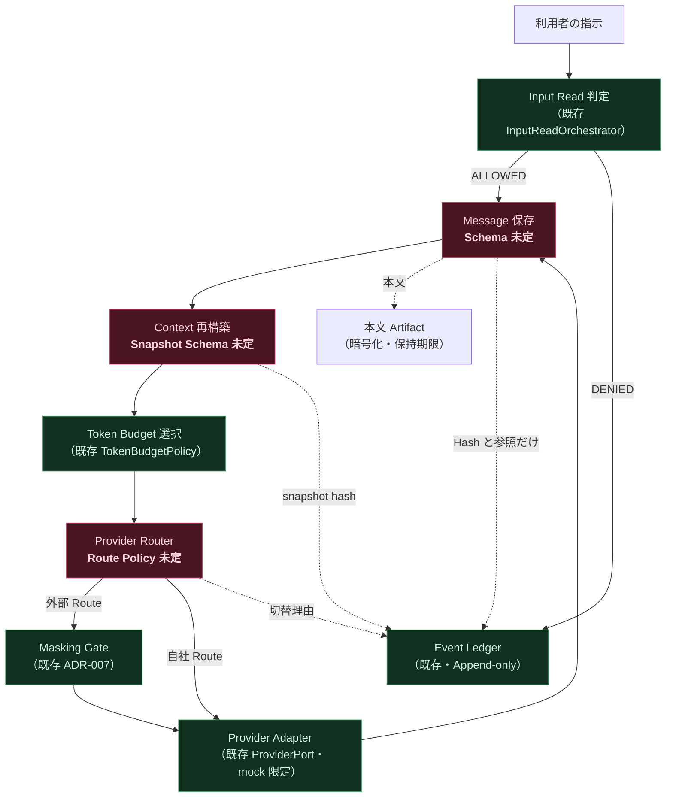
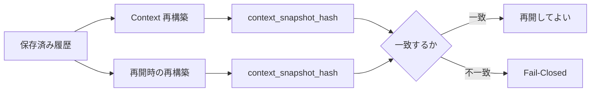

# チャット機能のデータフロー

本書は**現状で置ける経路**と、**まだ置けない経路**を分けて書く。

## 1 回の送信

赤は正本に定義が無いもの、緑は既存で使えるものである。

## 本文と Hash の分離

ロードマップ §2.3 の分離をそのまま使う。

| 置き場 | 入れるもの | 入れないもの |
|---|---|---|
| 本文 Artifact | 会話本文（暗号化・保持期限・削除記録） | — |
| Ledger / Event | `content_hash`、`normalized_hash`、Artifact ID、Policy Hash | 本文、Secret |
| Evidence | 観測値と Hash | 本文、Secret |
| Secret / Credential | — | 値そのもの（検出結果と Reject 理由だけ） |

## 再開時の同一性

同じ履歴から同じ Snapshot Hash が出ることが再開の条件である。
**一致しないまま再開しない。**

Hash の作り方は既存の Canonical JSON（`hash_canonical`）を使える。
ただし**何を Snapshot へ含めるか**が未定であり、そこが決まらないと Hash も決まらない。
Plan Content と同じ規則（ランダム ID・採番 ID・時刻・PID・列挙順を含めない、
不変条件#4）を当てるかどうかも Owner Decision である。

## まだ置けない経路

| 経路 | 置けない理由 |
|---|---|
| 実 Provider への送信 | `provider_id=mock` 以外を Production が拒否する |
| 外部 Route の選択 | Route Policy の語彙が正本に無い |
| 契約状態による候補絞り込み | 契約状態の語彙が正本に無い |
| 会話の Append-only 保証 | Conversation / Message の Schema が無い |
| Effect 実行 | `DEMO_ONLY` で禁じる。承認経路へ繋がない |
